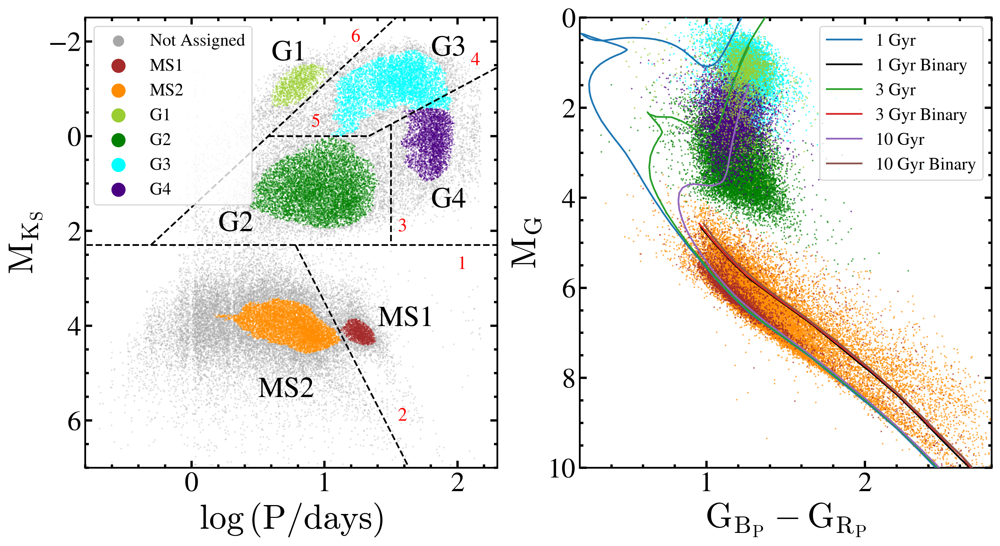
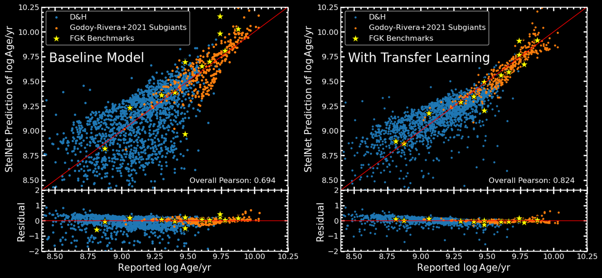

---

### Statistical Estimates of Population-Level Binary Properties

Building on my work with spotted rotational variables, this project develops a method to estimate the average primary masses, companion mass ranges, inclination limits for recognizing a rotational variable, and spreads in primary mass for populations of binary stars. The model fits a population's distribution in binary mass function (a cumbersome but observable combination of the two companion masses and orbital inclination) and allows for a probability that some of the mass functions are incorrectly estimated. We test the method on synthetic data to assess its sensitivity to each model parameter, finding that we are most sensitive to the average primary mass and companion mass range, with less sensitivity to inclination limit and primary mass spread. We then apply the model to the MS2b, G1/3, G2, and G4b stars described below.

This work is in preparation, to be submitted to MNRAS hopefully by the end of summer, 2024.

---

### Spotted Rotational Variable Stars with ASAS-SN, _Gaia_, and APOGEE

This work examines the properties of roughly 50,000 spotted rotational variables discovered in the [ASAS-SN](https://www.astronomy.ohio-state.edu/asassn/) variable stars catalog. We divided the rotators into 7 groups based on their separation in the space of luminosity versus rotation period (see the left panel of the figure below), and their radial velocity scatter (a proxy for binarity; not shown in the figure). There are three groups of main sequence stars: a group of slowly rotating (10-30 days) likely single stars with a limited range of temperatures (MS1), a group os more rappidly rotating (periods of ~days) single stars spanning the lower main sequence up to the Kraft break (MS2s) and a group of tidally-locked binaries (MS2b). There are four groups of giants: a group of heavily spotted and tidally locked RS CVn-type binaries with periods of 10's of days (G1/3), a group of less luminous sub-subgiants with periods of ~10 days (G2), a group of subsynchrounously rotating binaries with periods approaching 100 days (G4b), and a group of single red giants which are almost certainly merger remnants (G4s). 

This work is published in MNRAS, read more [here](https://ui.adsabs.harvard.edu/abs/2024MNRAS.527.5588P/abstract)!

---

### Transfer Learning for Improved Stellar Parameter Estimation with StelNet

Accurate determinations of stellar age and mass are crucial to many areas of Astronomy! The StelNet model [(Garraffo et al. 2021)](https://ui.adsabs.harvard.edu/abs/2021AJ....162..157G/abstract) is a hierarchical Bayesian collection of deep neural networks that aims to do just this with greater computational efficiency than traditional model fitting methods. It was originally trained on synthetic stellar evolutionary tracks from MIST, and while it does well in this regime, it is not expected to make estimates as accurately for actual stars. As part of the NSF REU program at the Smithsonian Astrophysical Observatory, I implemented "transfer learning" for StelNet, retraining the models on a small amount of real data to calibrate them for better performance on real stars and make them more robust against systematic errors. Below is a plot of StelNet's age predictions versus reported ages for a few catalogs of well-studied post-ZAMS stars before and after transfer learning.

To learn more, you can check out my [REU project report](../files/stelnet_summer), [live-streamed REU symposium talk](https://www.youtube.com/live/BS4W6ua18c4?si=DTzKrgAEs4IxsC2a&t=7130), and [AAS poster abstract](https://ui.adsabs.harvard.edu/abs/2024AAS...24330302P/abstract).

This work remains unpublished (although the code is all publicly available on GitHub), but a potential next step would be to alter the model to make age/mass estimates based on _Gaia_ photometry (rather than stellar surface parameters) and compare its performance on a large sample of stars to other neural network-based age estimators.