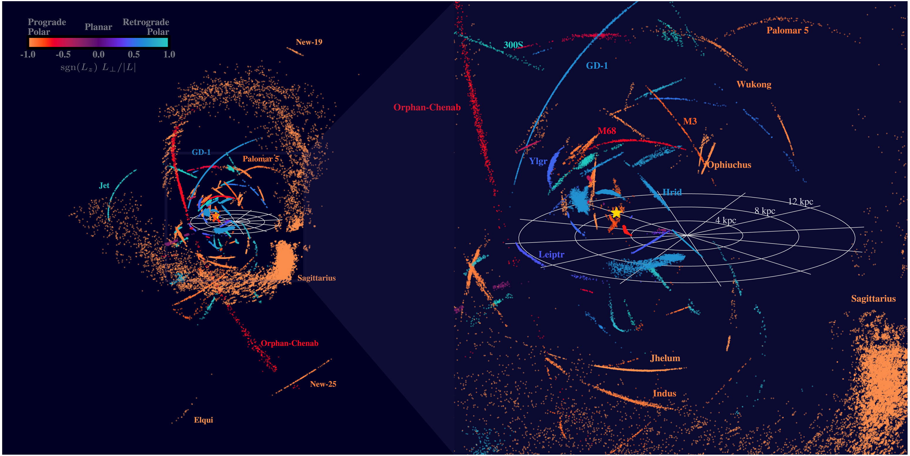
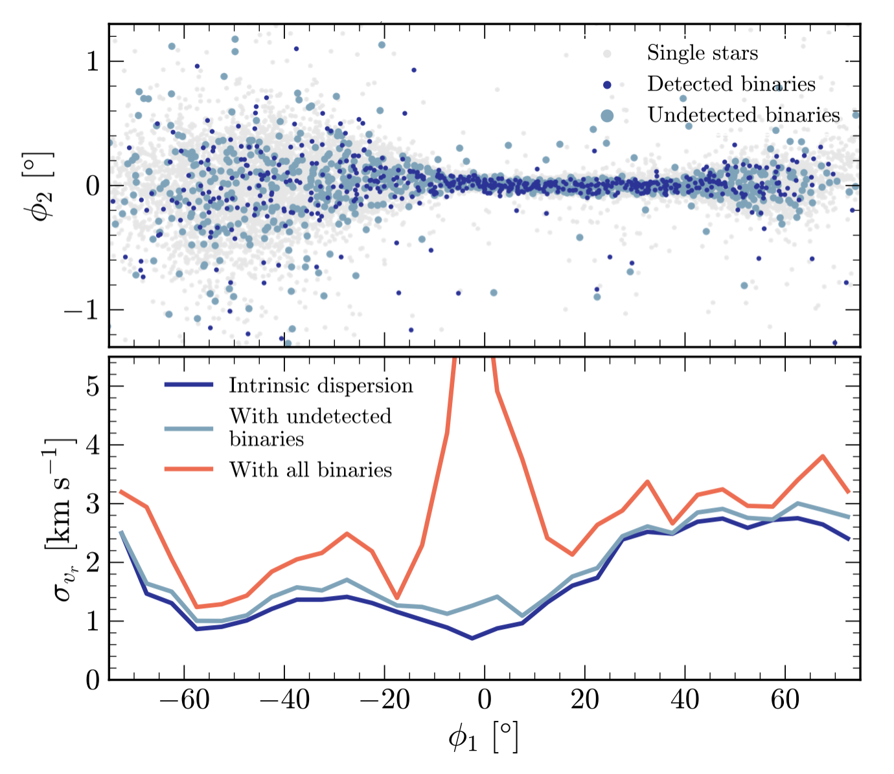
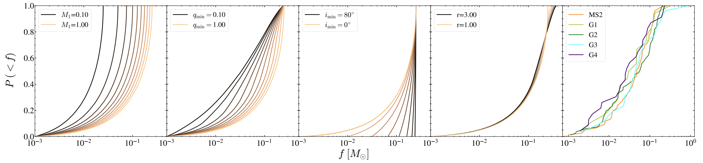
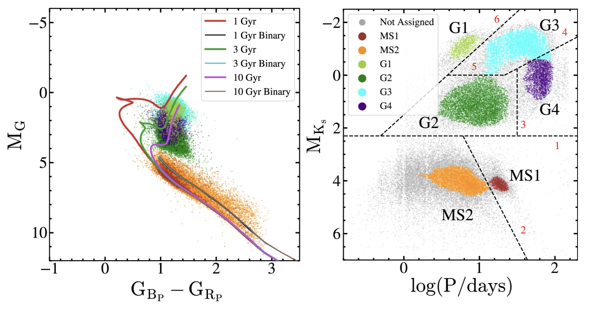
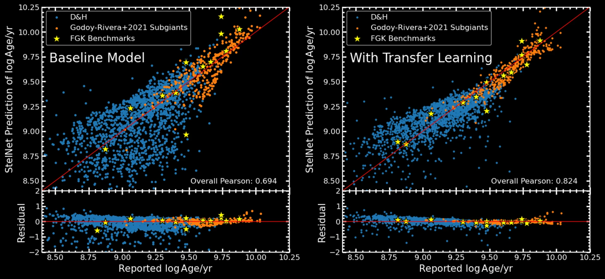

---

<small>Atlas of Milky Way stellar streams from [Bonaca & Price-Whelan (2024)](https://doi.org/10.1016/j.newar.2024.101713)</small>

My PhD thesis proposal is tentatively titled "The Nature of Dark Matter from Stellar Stream Kinematics," but a more accurate working title might be "interesting dynamical systems to Anya." 

The thin and dynamically fragile stellar streams of globular clusters represent a sensitive gravitational probe of small-scale structure (notably, the otherwise-invisible dark matter subhalos predicted by CDM cosmology) in the Milky Way. In the progenitor clusters of the most promising streams for dark matter inference, a complex interplay between mass loss-driven cluster expansion, two-body relaxation, and the evolving tidal radius all combine to produce the distribution function and binarity of stars escaping into the stream. 

Three relevant scales therefore emerge for us to study on the route to my aspirational thesis title: **the streams themselves, their progenitor clusters, and the individual binary systems within.** Throughout the rest of my degree I hope to populate this section with a list of projects across these three regimes using a combination of direct _N_-body simulations and high-resolution spectroscopy. 

- [The binary properties of stellar streams are set by cluster dynamics (Phillips+26)](https://iopscience.iop.org/article/10.3847/1538-4357/ae680b)
<!-- ### Binarity of Globular Cluster Streams -->

<!-- The stellar streams of globular clusters have the potential to serve as dark matter detectors, as long as the individual orbital motions of binary stars do not confuse our kinematic measurements of them. In this paper, we use direct N-body simulations to study the binary populations in GC streams given in-cluster dynamical processing. We include a first estimate of the added radial velocity dispersion from undetected binaries in upcoming dark matter-focused surveys like [Via](https://via-project.org/) (below).

 -->

<!-- This work is published in ApJ, you can read more [here](https://iopscience.iop.org/article/10.3847/1538-4357/ae680b) -->

---
Rotation provides a powerful stellar population diagnostic and is essential to understanding stellar structure and evolution. As an undergraduate, my research focus was on stellar rotation and binarity through the study of spotted rotational variables in the ASAS-SN catalog. 

- [Seven classes of rotational variables from a study of 50,000 spotted stars with ASAS-SN, _Gaia_, and APOGEE (Phillilps+23)](https://academic.oup.com/mnras/article/527/3/5588/7438887?login=false)
- [Statistical estimates of the binary properties of rotational variables (Phillips+24)](https://academic.oup.com/mnras/article/539/3/2608/8115781)

<!-- ### Statistical Estimates of Population-Level Binary Properties

This project develops a Monte Carlo-based method to estimate the binary properties of populations of spotted rotational variables using their radial velocity curves from APOGEE. The following plot shows the result for the binary mass function distribution of varying each model parameter (e.g., primary mass and its spread, mass ratio, minimum inclination), followed by the distributions for five groups of spotted rotational variables.

This work is published in MNRAS, read more [here](https://doi.org/10.1093/mnras/staf634) -->

<!-- ---

### Spotted Rotational Variable Stars with ASAS-SN, _Gaia_, and APOGEE

This work examines the properties of roughly 50,000 spotted rotational variables discovered in the [ASAS-SN](https://www.astronomy.ohio-state.edu/asassn/) variable stars catalog. The figure below divides the rotators into groups based on their separation in luminosity and rotation period. The groups are distinguished by their evolutionary phase and binarity, including (sub- and super-)syncronous tidally interacting systems.

This work is published in MNRAS, read more [here](https://ui.adsabs.harvard.edu/abs/2024MNRAS.527.5588P/abstract)!
 -->
<!-- 
---

### Transfer Learning for Improved Stellar Parameter Estimation with StelNet

Accurate determinations of stellar ages and masses are crucial to many areas of Astronomy! The StelNet model [(Garraffo et al. 2021)](https://ui.adsabs.harvard.edu/abs/2021AJ....162..157G/abstract) is a hierarchical Bayesian collection of deep neural networks that aims to do just this with greater computational efficiency than traditional model fitting methods. It was originally trained on synthetic stellar evolutionary tracks from MIST, and while it does well in this regime, it is not expected to make estimates as accurately for actual stars. As part of the NSF REU program at the Smithsonian Astrophysical Observatory, I implemented "transfer learning" for StelNet, retraining the models on a small amount of real data to calibrate them for better performance on real stars and make them more robust against systematic errors. Below is a plot of StelNet's age predictions versus reported ages for a few catalogs of well-studied post-ZAMS stars before and after transfer learning.

To learn more, you can check out my [REU project report](../files/stelnet_summer.pdf), [live-streamed REU symposium talk](https://www.youtube.com/live/BS4W6ua18c4?si=DTzKrgAEs4IxsC2a&t=7130), and [AAS iPoster](https://aas242-aas.ipostersessions.com/?s=03-E6-80-2D-D7-AC-E4-8B-0F-CB-EF-36-DF-2A-EE-C0).

This work remains unpublished (although the code is all publicly available on GitHub), but a potential next step would be to alter the model to make age/mass estimates based on _Gaia_ photometry (rather than stellar surface parameters) and compare its performance on a large sample of stars to other neural network-based age estimators. -->